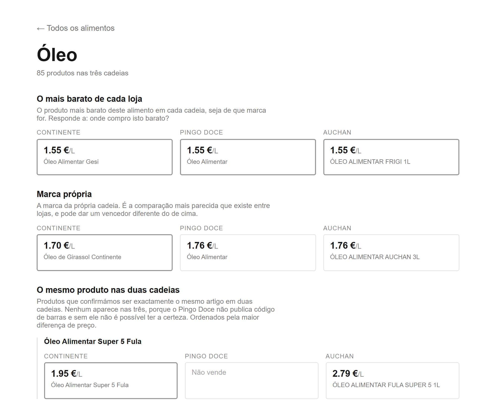
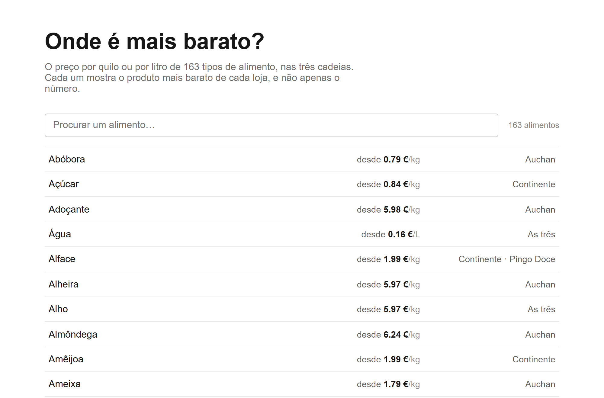
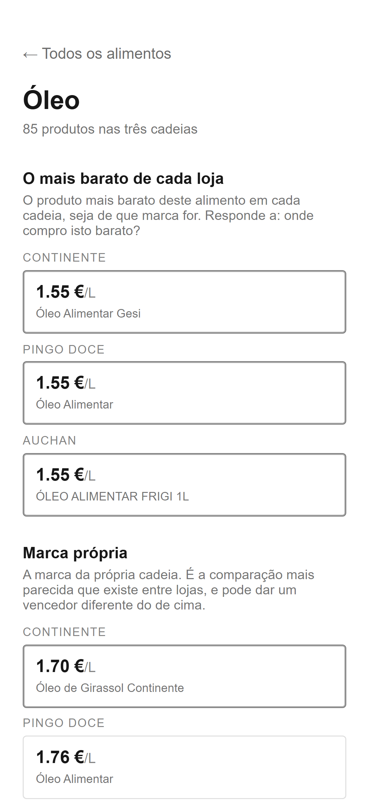

# Grocery Price Tracker (Portugal)

Compares the price per kilo and per litre of food at Portugal's three largest
supermarket chains: **Continente**, **Pingo Doce** and **Auchan**. It reads each
chain's online catalogue, works out what kind of food each product is, and
compares the chains like for like.



*One kind of food, cooking oil: the cheapest per litre at each chain, each
chain's own brand, and the same product at two chains. The cheapest oil costs
€1.55 a litre at all three. The same Fula oil costs €1.95 at Continente, on
promotion that week, and €2.79 at Auchan.*

| The list of foods, with a search box | The same page on a phone |
|---|---|
|  |  |

*The site is in Portuguese, for shoppers in Portugal. Prices from the crawls of
3 and 4 October 2026.*

## Why I built this

A perfect market assumes that every buyer is rational and that everyone has
the same information. In practice that is rarely true. Comparing the price of
the same food across three supermarket chains takes time, and different pack
sizes make it hard to see which is really cheaper. I built this app to make
that information easier to get, so people can make better decisions.

I also wanted to learn to work with AI agents for writing code, and this
project was a way to do that on a real problem.

## How this was built

I am a mathematician, not a software engineer. I designed and directed this
project; the code was written by Claude, Anthropic's AI coding agent, under my
direction.

My part was deciding what the tool should measure and how, setting the rules it
had to follow, and checking its results: questioning numbers that could not be
true, and rejecting conclusions based on too little evidence.

### Rules and skills used

The agent followed these rules in every session:

- **No request to a store without my approval**, including test runs.
- **Nothing committed, pushed or published without my approval.** Changes
  outside the project's files, such as creating a repository, are listed and
  approved first.
- **Count before making a rule about a whole group of products.**
- **Every number explained**: what it counts and where it comes from.
- **Plain language**, so I can judge design decisions without reading code.

A skill is a set of written instructions the agent follows for a repeated
task. This project has two:

- [`product-discovery`](.claude/skills/product-discovery/SKILL.md): given a
  search term, proposes groups of comparable products across the three chains.
  It separates fresh from frozen, checks labels against the price per kilo,
  uses drained weight for tinned food, and waits for my approval. It searches
  this project's own catalogue (`npm run discover`), not the stores; its first
  version used the stores' search pages, which their robots.txt forbids.
- [`run-catalogue-crawls`](.claude/skills/run-catalogue-crawls/SKILL.md): which
  crawl command to use for each store, how long each takes and how it saves,
  and the checks to make before, during and after a crawl. It was written after
  a crawl was started with the wrong command, chosen from its description
  instead of from what it does.

## At a glance

| | |
|---|---|
| Products collected | **45,869**: Continente 17,223 · Pingo Doce 10,273 · Auchan 18,373 |
| Products assigned a kind of food | **39,024** (85%) |
| Kinds of food defined so far | **177**, from *alheira* and *farinheira* to *tremoço* and *requeijão* |
| Kinds of food compared at all three chains so far | **163** |
| Identical products matched across two chains | **944** |
| Figures from | the crawls of 3 and 4 October 2026 |

The list of kinds of food is still being extended, and both counts grow with
it. The database itself is not published.

What the figures count:

- **Products collected**: the products each chain listed online at the most
  recent crawl.
- **Compared at all three chains**: each chain has at least one product of that
  kind with a price and a known size, so a price per kilo or litre exists for
  every chain.
- **Identical products**: the same item, for example the same brand and pack,
  at two chains. Matches are pairs, not triples, because Pingo Doce does not
  publish barcodes, and without a barcode two listings cannot be confirmed as
  the same item.

Prices are kept as a history: a new entry is saved only when a price changes.
The history starts on 19 August 2026.

## Respecting each store's rules

- **robots.txt.** Each website publishes a file saying what automated programs
  may and may not visit, and the three files differ. Continente and Pingo Doce
  forbid automated reading of their product listings; Auchan allows it. So
  Auchan's catalogue is read from its listings in under an hour, while
  Continente's and Pingo Doce's are read one product page at a time from the
  sitemaps they publish, which takes hours. An earlier version used the
  forbidden listings; it was replaced, and the old route is disabled.
- **A slow pace.** At most one request per second to each store. A failed
  request is retried at most twice, with longer waits each time, and a store's
  request to slow down (`Retry-After`) is followed.
- **A name in every request.** Each request introduces the crawler by its own
  name (`grocery-price-tracker/1.0`), not as a web browser, and carries a
  contact address, so a store can reach whoever is running the crawler. The address is not written
  in the code: whoever runs the crawlers puts their own in a private settings
  file (`.env`), and the crawlers refuse to start without one.
- **Public pages only.** No logins and no accounts. The prices are the public
  online prices, which can differ from in-store and loyalty-card prices.
- **Facts only.** Names, brands, prices, sizes, barcodes and the store's own
  category. No photographs, product descriptions or customer reviews are
  collected or shown, and the chains appear by name only, without logos.
- **Checked over time.** The robots.txt files and terms of use were recorded on
  13 August 2026 and checked again on 2, 3 and 4 October 2026. The robots.txt
  files had not changed, and none of the terms of use mentions automated access.

I also looked at the legal position under Portuguese and EU law before
collecting anything. Portugal's copyright code allows text and data mining,
including for commercial purposes, unless the site owner has reserved that
right in a machine-readable form (art. 75.º, n.º 2, al. w) of the CDADC, and
art. 15.º, al. f) of Decreto-Lei 122/2000, both as amended by Decreto-Lei
47/2023). None of the three chains has done so. This is my reading, not legal
advice.

## Problems we solved

1. **"Not sold" and "size unknown" are different.** A chain may show no price
   per kilo for rice because it does not sell rice, or because it sells rice but
   the pack size is unknown. Showing both as an empty cell would tell shoppers
   the chain does not sell rice. So each cell has three possible states (a
   price; *not sold*; *sold, size unknown*), and the pages show them
   differently.

2. **A tin of tuna has two weights.** A tin has a net weight (everything in it)
   and a drained weight (the food only). All three chains calculate their price
   per kilo from the drained weight. The own-brand 120 g tuna tin costs €1.12 at
   all three, so on net weight they tie at €9.33/kg. On drained weight, €1.12
   buys 85 g of fish at Pingo Doce and 78 g at the other two.

3. **Reading a size from a product name.** Each chain writes sizes in its own
   way, and the obvious reading is often wrong:

   | Written as | Obvious reading | Correct reading |
   |---|---|---|
   | `MARISCADA COZIDA UNIDADE 1.200 GR` | 1.2 g | 1,200 g: Portuguese separates thousands with a dot |
   | `AGUA C/ GAS VIMEIRO 6X050L` | six 50-litre bottles | six 0.5 L bottles: centilitres, without the decimal point |
   | `BOLO CAKE DESIGN Nº20 KG` | a 20 kg cake | cake design number 20, sold by the kilo |
   | `Cápsulas de Café Fortissimo Int 10 L'Or` | 10 litres of coffee | no size: *L'Or* is the brand |
   | `ACAFRAO AUCHAN MOIDO 3 DOSES 0.3 G` | perhaps 300 g | 0.3 g of saffron, about €10,000/kg |

   The last row is why the thousands rule applies only to exactly three digits
   after the dot. Each rule is tested on the cases it must change and on the
   cases it must leave alone.

4. **Sorting products into kinds of food.** Each kind of food is defined by the
   words that name it, with exclusions where a word misleads: *pasta* is not
   *pasta de dentes* (toothpaste). Exclusions must be precise. A rule meant to
   separate sweets from chocolate excluded every name containing *caramelo*,
   which removed 285 caramel-filled chocolate bars, until it was changed to
   exclude caramel only when the name does not mention chocolate. I chose rules
   over a trained model because there was no labelled data to train on, and
   because every decision a rule makes can be read and traced back to it.

5. **Shelves that name several foods.** When a product's name does not say what
   it is, the program uses the store's shelf name. Many shelves name several
   foods, such as "Banana, Maçã e Pera", and the program took the first one.
   Across the catalogue this affected 2,271 products, mostly wrongly: bananas
   filed as apples, pasta as rice. Now a shelf decides only when it names one
   food; otherwise the product stays unclassified. Each version of this rule
   was tested on the whole catalogue before being kept.

6. **Checking a fix before applying it.** Some products seemed to contradict
   themselves, for example a kind of food measured by weight but sold in
   litres. An automatic fix was written, and tested before it was applied: it
   would have changed 765 correct products, such as whipped cream, which really
   is sold in 0.25 L packs. It was dropped. These cases are now listed for
   review instead.

7. **Pack price or price per kilo?** For products sold by weight, such as a
   whole chicken, the page shows a price that is already per kilo (`2,49€/kg`)
   next to the weight of one item (`2,95 kg`). Dividing one by the other gave
   €0.84/kg. The program now reads the `/kg` after the price. The rule was
   written from five product pages and tested on them first.

8. **Running out of memory.** The first full Continente crawl stopped after
   2,200 of its 17,292 products because the computer ran out of memory. Each
   product page is about 2 MB. The crawler kept only a few words from each page,
   but because of how JavaScript stores text, keeping those few words also kept
   the whole 2 MB page in memory. Copying the words into new text let each page
   be discarded: the memory kept per product fell from about 2 MB to about
   0.1 KB.

9. **When the store's data is wrong.** Some errors are the store's own: Pingo
   Doce labels a pack of crackers "3.36 Kg". No reading rule can fix that, so
   such products are kept in a short list, each with the store's own text as
   evidence and the date it was checked. They stay out of price-per-kilo
   comparisons but are not deleted, and a check notices when the store changes
   its data so the entry can be reviewed. Deciding that data is wrong is always
   a person's call.

10. **A crawl that finishes is not a crawl that worked.** The first Pingo Doce
    crawl finished normally with less than half the catalogue. So the Auchan
    and Continente crawls now write a report on themselves, ending in OK, WARN
    or FAIL: whether it collected as many products as the store says it has,
    whether a section shrank since the last run, and whether the run stopped
    halfway. A bad crawl never marks products as removed.

## Current limitations

- **Continente sizes.** A size is known for 60% of Continente's food products,
  against 89 to 94% at the other two chains, so Continente is in fewer
  comparisons. The same wine at two chains cannot be compared yet: 168
  identical wines are matched, but none has a known size at both.
- **Prices are from one weekend's crawls**, on 3 and 4 October 2026. The crawls
  do not yet run on a daily schedule.
- **Pingo Doce shows no online price** for 2,933 of its 10,273 products.
- **Some kinds of food are too broad to rank fairly.** *Queijo* (cheese) covers
  everything from a children's fromage frais to a cured Serra da Estrela.
- **Not online yet.** The site runs on my computer; it is not public.

## Technical overview

TypeScript throughout: **Next.js 16** for the site, **Prisma 7** with
**SQLite** for storage. Pages are fetched with plain HTTP requests, without a
browser; prices and product details are read from the structured data the
stores include in their pages.

| Where | What |
|---|---|
| `src/scrapers/crawl/` | the catalogue crawler for each chain |
| `src/scrapers/http.ts` | the shared fetcher: pace, retries, `Retry-After` |
| `src/lib/matching.ts` | reading sizes and normalising product names |
| `data/food-types.ts` | the 177 kinds of food |
| `src/lib/comparison.ts` | the comparison rules, including the three cell states |
| `src/app/grupos/` | the comparison pages (in Portuguese) |
| `src/scrapers/crawl/*report*.ts` | the reports each crawl writes about itself |
| `src/scripts/verify-*.ts` | the automated checks |
| `src/scripts/discover.ts` | searches the catalogue for a product across the three chains |
| `data/store-errors.ts` | products whose store publishes impossible data, with evidence |
| `.claude/skills/` | the instructions the AI agent follows for repeated tasks |

The site is in Portuguese, since it is meant for shoppers in Portugal.

### Running it

```bash
npm install
cp .env.example .env             # the private settings file, never uploaded
npx prisma migrate dev           # creates the database
npm run verify:nightly           # the automated checks; no requests to the stores
npm run dev                      # the site, at http://localhost:3000/grupos
npm run discover -- carapau      # find a product in the catalogue (no network)
```

Filling the database means crawling the stores (`npm run crawl:auchan:nightly`,
`npm run crawl:continente:nightly`, `npm run crawl:pingodoce:nightly`, then
`npm run classify:food`). Each of these saves as it goes, so a run that stops
early keeps what it had already collected. These make real requests to the chains' websites and
take hours, so please do not run them. Whoever does must first put their own
email address or web page in `.env` as `CRAWLER_CONTACT` (see `.env.example`),
because every request names them.

Notes on the original hand-picked product list and its daily scrape are in
[`docs/operations.md`](docs/operations.md).
